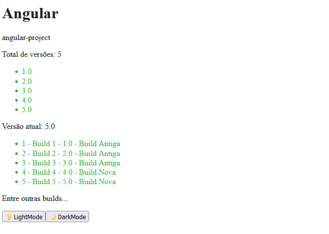

<h1 align="center"> Estudos - Angular</h1>

Projeto com fins de estudos.

<h2>🚀 Tecnologias utilizadas: </h2>

- Angular
- TypeScript

<h2>🚀 O que foi estudado: </h2>

- Templates e Variáveis
- Loop
- Classes
- Condicionais
- Bind de Propriedades
- Styles e Class
- Eventos de Clique e Teclado
- Variável Auxiliar
